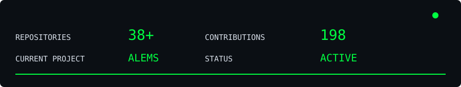

<div align="center">


```text
[ SYSTEM ONLINE ]  [ DEVELOPER MODE ]  [ FULL STACK ]
```


<a href="https://rohith-kp.vercel.app/"></a>
<a href="https://linkedin.com/in/rohith-k-p"></a>
<a href="https://www.instagram.com/r__o_h_i_t__h/"></a>
<a href="mailto:rohithkp549@gmail.com"></a>

</div>

---

# `01` — SYSTEM PROFILE

```text
root@rohithkp:~$ whoami

NAME       : Rohith K P
ROLE       : Software Developer
MODE       : Full Stack
STATUS     : ONLINE
FRONTEND   : React / Angular
BACKEND    : Python / Django / Flask
DATABASE   : MySQL / SQLite / Firebase
API        : REST / JSON
IoT        : ESP32 / Raspberry Pi
CURRENT    : ALEMS
```

> Building practical software, testing real systems, solving problems and continuously improving.

---

# `02` — TECHNICAL STACK

<div align="center">

</div>

---

# `03` — CURRENT PROJECT

<div align="center">

</div>

**ALEMS** is an Academic Learning & Examination Management System for academic workflows, examinations, marks, students, teachers and administration.

---

# `04` — GITHUB ANALYTICS

<div align="center">

</div>

<div align="center">

**38+ REPOSITORIES** &nbsp; · &nbsp; **198 CONTRIBUTIONS** &nbsp; · &nbsp; **ACTIVE DEVELOPMENT**

</div>

---

# `05` — DEVELOPMENT ACTIVITY

<div align="center">
<strong>⚡ ENGINEERING FOCUS</strong>

<table>
<tr><th>AREA</th><th>TECHNOLOGIES</th><th>STATUS</th></tr>
<tr><td>Full Stack Development</td><td>React · Angular · Django · Flask</td><td> ACTIVE</td></tr>
<tr><td>Backend Engineering</td><td>Python · Django · Flask · REST APIs</td><td> ACTIVE</td></tr>
<tr><td>Frontend Development</td><td>React · Angular · JavaScript</td><td> ACTIVE</td></tr>
<tr><td>API Development</td><td>REST · JSON · Axios · Postman</td><td> ACTIVE</td></tr>
<tr><td>IoT & Automation</td><td>ESP32 · Raspberry Pi · Firebase</td><td> ACTIVE</td></tr>
<tr><td>Cloud & Deployment</td><td>Firebase · Docker · GitHub</td><td> LEARNING</td></tr>
</table>

```text
BUILDING  ████████████████████  100%
LEARNING  ██████████████████░░   90%
TESTING   ████████████████░░░░   80%
SHIPPING  ██████████████░░░░░░   70%
```

<strong>IDEA → DESIGN → BUILD → TEST → IMPROVE → SHIP</strong>
</div>

---

# `06` — DEVELOPMENT LOOP

<div align="center">

</div>

```text
IDEA → DESIGN → CODE → TEST → DEBUG → IMPROVE → DEPLOY → REPEAT
```

---

# `07` — PROJECT DATABASE

<div align="center">

</div>

---

# `08` — FREELANCE MODE

```text
root@rohithkp:~$ services --list

[01] BUSINESS WEBSITES
[02] CUSTOM WEB APPLICATIONS
[03] MANAGEMENT SYSTEMS
[04] REST API DEVELOPMENT
[05] EDUCATIONAL PLATFORMS
[06] IoT APPLICATIONS
[07] CUSTOM SOFTWARE
[08] INVITATION WEBSITES
```

**Companies · Entrepreneurs · Businesses · Startups · Educational Organizations · Personal Brands**

---

# `09` — LEARNING QUEUE

```text
[01] Advanced System Design     [LOADING...]
[02] Cloud Deployment           [LOADING...]
[03] AI Integration             [LOADING...]
[04] Docker                     [LOADING...]
[05] Scalable Architecture      [LOADING...]
```

---

# `10` — ENGINEERING PHILOSOPHY

<div align="center">

```text
KEEP LEARNING.
KEEP BUILDING.
KEEP TESTING.
KEEP IMPROVING.
```

</div>

---

# `11` — CONNECT

<div align="center">

<a href="https://rohith-kp.vercel.app/">🌐 PORTFOLIO</a> &nbsp; · &nbsp;
<a href="https://linkedin.com/in/rohith-k-p">💼 LINKEDIN</a> &nbsp; · &nbsp;
<a href="https://www.instagram.com/r__o_h_i_t__h/">📸 INSTAGRAM</a> &nbsp; · &nbsp;
<a href="mailto:rohithkp549@gmail.com">✉ EMAIL</a>

<br><br>


```text
root@rohithkp:~$ system-status

SYSTEM       : ONLINE
DEVELOPER    : ROHITH K P
MODE         : FULL STACK
PROJECT      : ALEMS
STATUS       : READY

root@rohithkp:~$ _
```

### `BUILD → TEST → DEBUG → IMPROVE → SHIP`

</div>
