<div align="center">

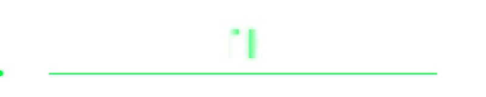

```text
[ SYSTEM ONLINE ]  [ DEVELOPER MODE ]  [ FULL STACK ]
```


</div>

---

# `01` — SYSTEM PROFILE
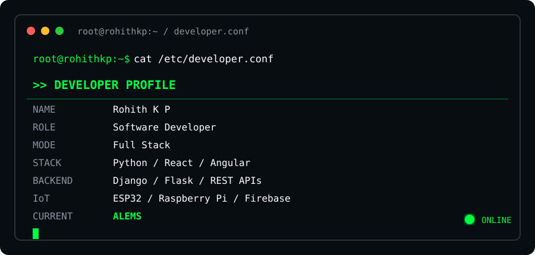

<a href="https://rohith-kp.vercel.app/"></a>
<a href="https://linkedin.com/in/rohith-k-p"></a>
<a href="https://www.instagram.com/r__o_h_i_t__h/"></a>
<a href="mailto:rohithkp549@gmail.com"></a>


> Building practical software, testing real systems, solving problems and continuously improving.

---

# `02` — TECHNICAL STACK

<div align="center">
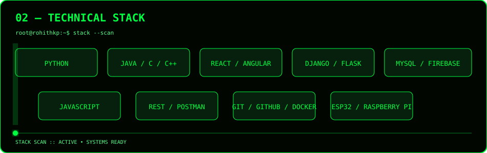
</div>

---

# `03` — CURRENT PROJECT

<div align="center">
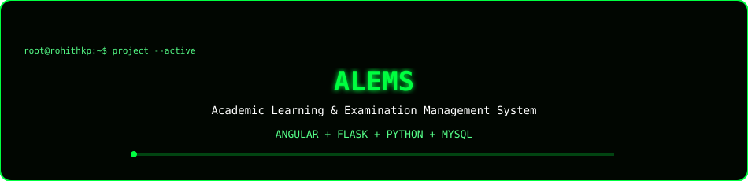
</div>

**ALEMS** is an Academic Learning & Examination Management System for academic workflows, examinations, marks, students, teachers and administration.

---

# `04` — GITHUB ANALYTICS

<div align="center">
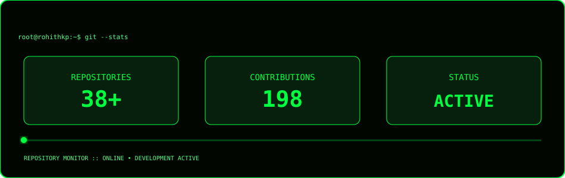
</div>

---

# `05` — DEVELOPMENT ACTIVITY

<div align="center">
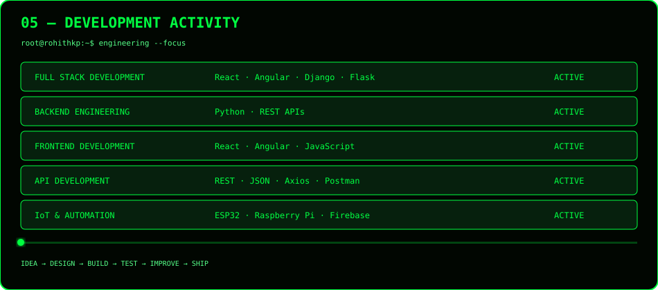
</div>

---

# `06` — DEVELOPMENT LOOP

<div align="center">
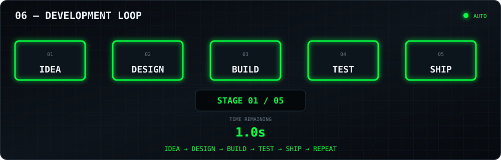
</div>

```text
IDEA → DESIGN → CODE → TEST → DEBUG → IMPROVE → DEPLOY → REPEAT
```

---

# `07` — PROJECT DATABASE

<div align="center">
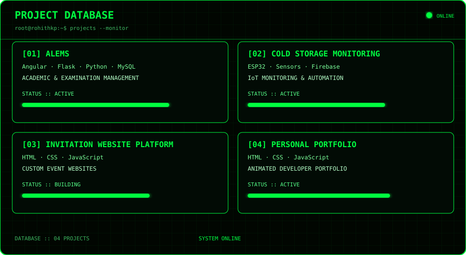
</div>

---

# `08` — FREELANCE MODE

<div align="center">
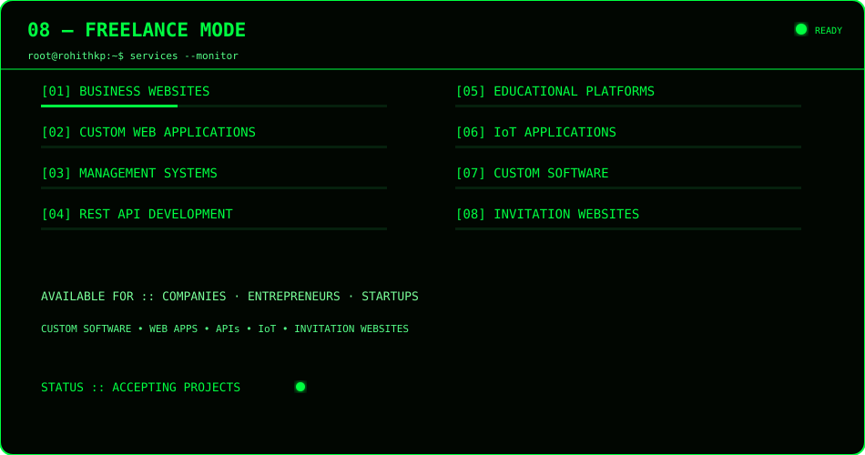
</div>

---

# `09` — LEARNING QUEUE

<div align="center">
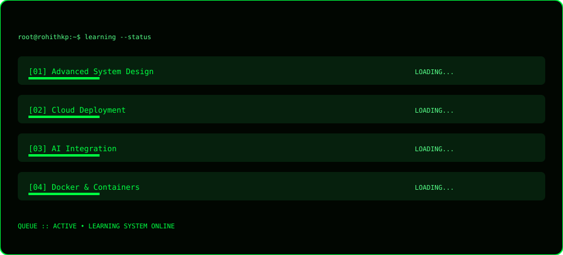
</div>

---

# `10` — ENGINEERING PHILOSOPHY

<div align="center">
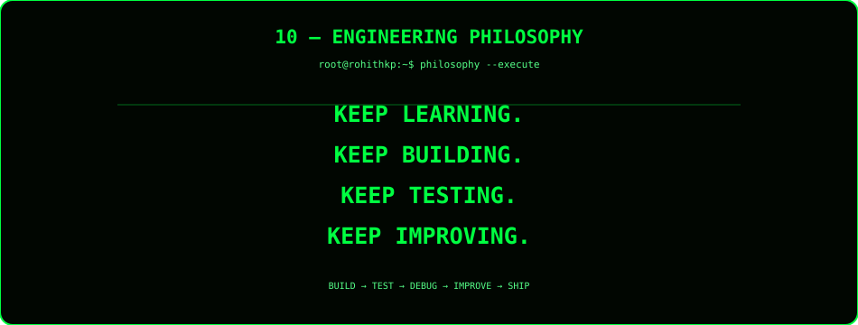
</div>

---

# `11` — CONNECT

<div align="center">
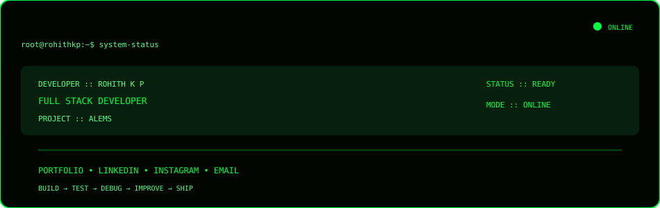

<a href="https://rohith-kp.vercel.app/">🌐 PORTFOLIO</a> &nbsp; · &nbsp;
<a href="https://linkedin.com/in/rohith-k-p">💼 LINKEDIN</a> &nbsp; · &nbsp;
<a href="https://www.instagram.com/r__o_h_i_t__h/">📸 INSTAGRAM</a> &nbsp; · &nbsp;
<a href="mailto:rohithkp549@gmail.com">✉ EMAIL</a>

<br><br>


</div>
